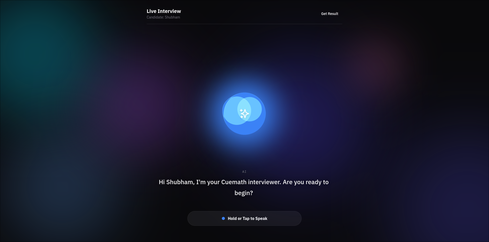

# 🎙️ VocalHire



VocalHire is a real-time, voice-driven AI Interview platform designed to simulate a highly realistic technical interview experience. Built with a focus on ultra-low latency and natural conversation flow, it features live voice activity detection (VAD), conversational interruption, and comprehensive post-interview evaluation.

## ✨ Key Features

* **Real-Time Voice Activity Detection (VAD):** The browser automatically detects when the user stops speaking, eliminating the need for manual "stop recording" buttons and creating a natural conversational flow.
* **Seamless AI Interruption:** Users can interrupt the AI mid-sentence. The system instantly halts audio playback, clears memory, and opens the microphone.
* **Zero-Latency Silence Handling:** Uses localized audio caching to handle silent or inaudible inputs without wasting API calls or generating processing delays.
* **Dynamic UI & Visualizer:** Features a custom "Midnight/Zinc" responsive theme with a Liquid Visualizer and a dynamic Framer Motion guidance pill that reacts to the system's state (Idle, Listening, Speaking, Processing).
* **Comprehensive Evaluation:** Generates a detailed candidate report based on the entire transcript once the interview is concluded.

## 🛠️ Tech Stack

**Frontend**
* React.js (Vite)
* Tailwind CSS (Custom CSS Variables Theme)
* Framer Motion (Animations)
* HTML5 Web Audio API & MediaRecorder

**Backend**
* Node.js & Express.js
* Groq API (High-speed LLM inference)
* Deepgram API (Speech-to-Text / Text-to-Speech)

**Infrastructure & Deployment**
* **Frontend:** Vercel
* **Backend:** Dockerized on AWS EC2
* **Proxy:** Nginx (Reverse Proxy handling multiple containers)
* **Security:** HTTPS via Certbot (Let's Encrypt) & DuckDNS

## 🏗️ Architecture Overview

VocalHire operates on a Monorepo structure but utilizes a split deployment model for maximum efficiency:
1. **The React Frontend** is hosted statically on **Vercel**, providing global edge delivery and fast load times.
2. **The Express Backend** is containerized using **Docker** and hosted on a persistent **AWS EC2** instance. This prevents the "cold-start" delays common in serverless backends, ensuring the audio streaming remains instantaneous. Nginx routes traffic securely to the isolated Docker container.

## 🚀 Local Development Setup

### Prerequisites
* Node.js (v18+)
* Docker (optional, for backend containerization)
* API Keys for Groq and Deepgram

### 1. Clone the repository
```bash
git clone [https://github.com/Staggered95/vocal-hire.git](https://github.com/Staggered95/vocal-hire.git)
cd vocal-hire